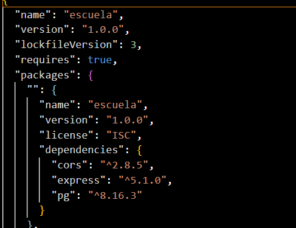

# Escuela
Proyecto backend sobre mi escuela 

# Base de datos en PgAdmin

 Tabla: estudiantes
 Insertar estudiante
INSERT INTO estudiantes (nombre, carrera, numero_control, periodo_inicio, semestre, contrasena)
VALUES ('Juan Pérez', 'Ingeniería en Sistemas', '2025001', '2025-1', 1, '1234');

Respuesta esperada:

INSERT 0 1

 Ver todos los estudiantes
SELECT * FROM estudiantes;

Ejemplo de salida:

 id |   nombre    |        carrera        | numero_control | periodo_inicio | semestre | contrasena
----+-------------+-----------------------+----------------+----------------+----------+------------
  1 | Juan Pérez  | Ingeniería en Sistemas| 2025001        | 2025-1         |        1 | 1234

 Actualizar estudiante
UPDATE estudiantes
SET nombre = 'Juan P. Ramírez', semestre = 2, contrasena = 'abcd'
WHERE id = 1;

Respuesta esperada:

UPDATE 1

 Eliminar estudiante
DELETE FROM estudiantes WHERE id = 1;

Respuesta esperada:

DELETE 1

 Tabla: materias
 Insertar materia
INSERT INTO materias (nombre, creditos)
VALUES ('Programación I', 6);

Respuesta esperada:

INSERT 0 1

 Ver materias
SELECT * FROM materias;

Ejemplo de salida:

 id |     nombre      | creditos
----+-----------------+----------
  1 | Programación I  |        6

 Actualizar materia
UPDATE materias
SET nombre = 'Programación Básica', creditos = 5
WHERE id = 1;

Respuesta esperada:

UPDATE 1

 Eliminar materia
DELETE FROM materias WHERE id = 1;

Respuesta esperada:

DELETE 1

 Tabla: avance (relación estudiante ↔ materia)
 Inscribir estudiante en materia
INSERT INTO avance (id_estudiante, id_materia, estado)
VALUES (1, 1, 'cursando');

Respuesta esperada:

INSERT 0 1

 Ver avance de un estudiante
SELECT a.id, e.nombre AS estudiante, m.nombre AS materia, a.estado
FROM avance a
JOIN estudiantes e ON a.id_estudiante = e.id
JOIN materias m ON a.id_materia = m.id
WHERE e.id = 1;

Ejemplo de salida:

 id | estudiante  |    materia     |  estado
----+-------------+----------------+----------
  1 | Juan Pérez  | Programación I | cursando

 Actualizar estado del avance
UPDATE avance
SET estado = 'aprobada'
WHERE id = 1;

Respuesta esperada:

UPDATE 1

 Eliminar avance
DELETE FROM avance WHERE id = 1;

Respuesta esperada:

DELETE 1
______________________________________________________________________________________

# Instalacion Framework Express

Requisitos previos
Antes de instalar Express.js, asegúrate de tener lo siguiente:
Node.js (versión 18 o superior recomendada)
npm (instalado junto con Node.js)
Una terminal o consola de comandos (CMD, PowerShell o terminal de VS Code) Para verificar si los tienes:
node -v npm -v
 
Pasos para instalar Express.js
1.	Crear una carpeta para tu proyecto
mkdir mi-proyecto-express cd mi-proyecto-express
 
2.	Inicializar Node.js en el proyecto
Esto crea el archivo package.json:
npm init -y
3.	Instalar Express
npm install express
Opcionalmente, instala nodemon para reiniciar el servidor automáticamente: npm install --save-dev nodemon
 
4.	Configurar scripts en package.json Edita el package.json y agrega: "scripts": {
"start": "node index.js", "dev": "nodemon index.js"
}
 

 
2.	Estructura de un Proyecto con Express
Aunque Express es flexible y no impone una estructura rígida, se recomienda la siguiente organización para mantener el código limpio y escalable.
mi-proyecto-express/ ESCUELA/
│
├── backend/
│	├── routes/
│ │	└── db.js	# Rutas relacionadas con base de datos
│ │
│	├── index.js	# Punto de entrada del backend
│	└── db/	# Conexión y configuración de la base de datos
│
├── frontend/
│	└── app.js	# Archivo JS para el frontend (puede ser lógica cliente)
│
├── avance.html	# Vista HTML
├── estudiantes.htlm	# (posiblemente sea estudiantes.html, error de nombre)
├── index.html	# Página principal
├── materias.html	# Otra vista HTML
│
├── node_modules/	# Dependencias instaladas
├── package.json	# Configuración de npm
├── package-lock.json	# Versiones exactas de dependencias
└── README.md	# Documentación

3.	pgAdmin 4 (Administrador de PostgreSQL)
pgAdmin 4 es una herramienta gráfica para administrar bases de datos PostgreSQL. Instalación de pgAdmin 4

Instalar
Ejecuta el instalador descargado y sigue las instrucciones. Durante la instalación, se te pedirá:
Puerto de conexión (por defecto: 5432)
Contraseña del usuario administrador (postgres)
 
Conectar pgAdmin a tu base de datos

Conectar Express a PostgreSQL
Instala el cliente de PostgreSQL para Node.js: npm install pg
Archivo src/config/db.js:
const { Pool } = require('pg'); require('dotenv').config();

const pool = new Pool({
user: process.env.DB_USER, host: process.env.DB_HOST, database: process.env.DB_NAME,
password: process.env.DB_PASSWORD, port: process.env.DB_PORT
});

module.exports = pool; Archivo .env: DB_USER=postgres DB_HOST=localhost DB_NAME=tienda_db
DB_PASSWORD=tu_contraseña DB_PORT=5432
 
Nuestro ejemplo con Pool
 
_______________________________________________________________________________________________________

# Donde se ve que esta instalado nuestro framework?
Se puede ver en nuestro package-lock.json

como lo ejecutamos?

Si en tu package.json tienes un script como:

"scripts": {
  "start": "node server.js",
  "dev": "nodemon server.js"
}

_______________________________________________________________________________________________________
# Conexión BD a Framework Express

En /routes/db.js hacemos la conexion de nuestra base de datos con express con la libreria "pg"

Crear el pool de conexión

const pool = new Pool({
  user: 'postgres',
  host: 'localhost',
  database: 'escuela',
  password: '1234',
  port: 5432,
});

y exportamos con

export default pool;

_______________________________________________________________________________________________________

# Rutas usadas con Framework

app.post("/register", async (req, res) => {
  const { nombre, carrera, numero_control, periodo_inicio, semestre, contrasena } = req.body;

  try {
    const result = await pool.query(
      `INSERT INTO estudiantes (nombre, carrera, numero_control, periodo_inicio, semestre, contrasena)
       VALUES ($1, $2, $3, $4, $5, $6) RETURNING id, nombre, numero_control`,
      [nombre, carrera, numero_control, periodo_inicio, semestre, contrasena]
    );
    res.json(result.rows[0]);
  } catch (err) {
    console.error("Error al registrar usuario:", err);
    res.status(400).json({ error: "No se pudo registrar el usuario" });
  }
});
// Login
app.post("/login", async (req, res) => {
  const { numero_control, contrasena } = req.body;
  try {
    const result = await pool.query(
      "SELECT * FROM estudiantes WHERE numero_control=$1 AND contrasena=$2",
      [numero_control, contrasena]
    );

    if (result.rows.length === 0) {
      return res.status(401).json({ error: "Credenciales incorrectas" });
    }

    res.json({ message: "Login exitoso", user: result.rows[0] });
  } catch (err) {
    console.error("Error en login:", err);
    res.status(500).json({ error: "Error en el servidor" });
  }
});
// Actualizar usuario
app.put("/usuario/:id", async (req, res) => {
  const { id } = req.params;
  const { nombre, carrera, contrasena } = req.body;

  try {
    const result = await pool.query(
      `UPDATE estudiantes
       SET nombre=$1, carrera=$2, contrasena=$3
       WHERE id=$4
       RETURNING *`,
      [nombre, carrera, contrasena, id]
    );
    res.json(result.rows[0]);
  } catch (err) {
    console.error("Error al actualizar usuario:", err);
    res.status(400).json({ error: "No se pudo actualizar el usuario" });
  }
});
// Eliminar usuario
app.delete("/usuario/:id", async (req, res) => {
  try {
    await pool.query("DELETE FROM estudiantes WHERE id=$1", [req.params.id]);
    res.json({ message: "Usuario eliminado" });
  } catch (err) {
    console.error("Error al eliminar usuario:", err);
    res.status(400).json({ error: "No se pudo eliminar el usuario" });
  }
});

